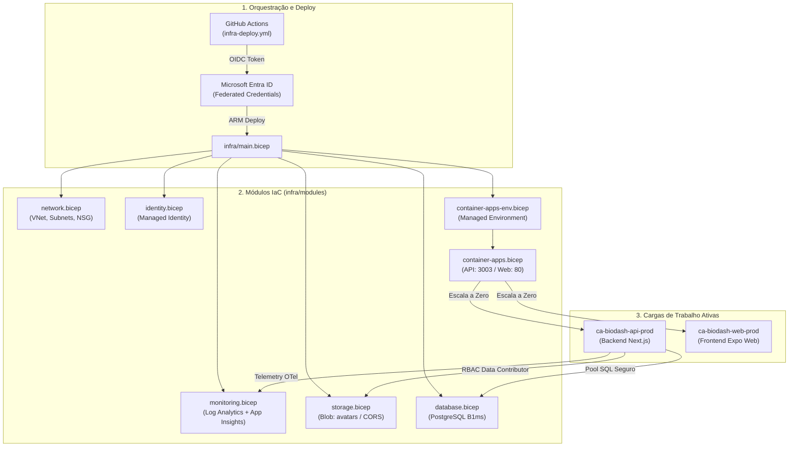
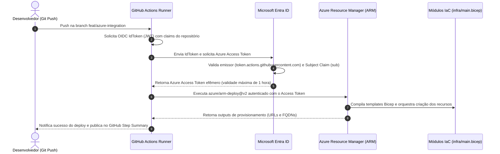

# Arquitetura de Infraestrutura como Código (IaC)

---

## 1. Funcionamento Geral da Infraestrutura como Código (IaC)

A infraestrutura do ecossistema **BioDash** é provisionada, versionada e gerenciada inteiramente como código (**Infrastructure as Code — IaC**) utilizando **Microsoft Azure Bicep** (DSL declarativa moderna compilada para ARM Templates).

A abordagem foi desenhada para atender às diretrizes do projeto ([migracao_aws_para_azure.md](../tasks/migra_o_aws_para_azure.md)), adotando quatro pilares fundamentais:

### 1.1. Arquitetura Modular e Desacoplada (Hub & Spoke)
Em vez de um manifesto monolítico, a infraestrutura adota o padrão **Orchestrator & Modules**:
* O arquivo mestre [main.bicep](file:///c:/Projetos/Fatec/BioGen/BioDash_mobile/infra/main.bicep) atua como orquestrador de escopo de Resource Group, resolvendo dependências automaticamente e repassando outputs entre módulos.
* O arquivo [subscription.bicep](file:///c:/Projetos/Fatec/BioGen/BioDash_mobile/infra/subscription.bicep) gerencia o escopo global da assinatura (*Azure for Students*), criando o Resource Group e disparando a infraestrutura.
* Cada domínio de serviço reside em seu próprio módulo reutilizável na pasta [infra/modules/](file:///c:/Projetos/Fatec/BioGen/BioDash_mobile/infra/modules).

### 1.2. Segurança Passwordless & Princípio do Menor Privilégio
* **Autenticação OIDC no GitHub Actions:** Não existem credenciais estáticas de longa duração (`AZURE_CREDENTIALS`) salvas no repositório. O GitHub Actions solicita tokens JWT de curta duração autenticados pelo Microsoft Entra ID via credenciais federadas.
* **Managed Identity:** O backend consome serviços nativos da Azure via **User-Assigned Managed Identity (`id-biodash-prod`)** com papel RBAC *Storage Blob Data Contributor*, eliminando connection strings gravadas no código.
* **Sanitização de Segredos:** A pipeline de CI/CD sanitiza automaticamente quebras de linha (`\r\n`) de segredos sensíveis (como a senha do PostgreSQL) antes do envio ao Azure Resource Manager.

### 1.3. FinOps Custo Zero (Azure for Students)
* **Escala a Zero (Scale-to-Zero):** Azure Container Apps configurados com `minReplicas: 0`. Na ausência de requisições ativas, o consumo de CPU e memória é zero.
* **Docker Hub como Registry:** Uso de imagens públicas gratuitas no Docker Hub, eliminando o custo proibitivo do Azure Container Registry (ACR).
* **SKUs Burstable e Gratuitos:** PostgreSQL Flexible Server em SKU Burstable `Standard_B1ms` (750 horas/mês gratuitas) e Storage Account `Standard_LRS` no tier Hot com retenção econômica de logs no Log Analytics (1 GB/dia).



---

## 2. Mapa dos Arquivos e Módulos `.bicep`

A tabela abaixo detalha o propósito, escopo e responsabilidades técnicas de cada arquivo da pasta [infra/](file:///c:/Projetos/Fatec/BioGen/BioDash_mobile/infra):

| Arquivo | Escopo | Responsabilidade Resumida |
| :--- | :--- | :--- |
| [**`main.bicep`**](file:///c:/Projetos/Fatec/BioGen/BioDash_mobile/infra/main.bicep) | Resource Group | **Orquestrador Mestre.** Recebe parâmetros de ambiente, gera nomes determinísticos via `uniqueString`, define a ordem de dependências e chama todos os submódulos repassando outputs. |
| [**`subscription.bicep`**](file:///c:/Projetos/Fatec/BioGen/BioDash_mobile/infra/subscription.bicep) | Subscription | **Orquestrador Global.** Provisiona o Resource Group (`rg-biodash-prod`) em nível de assinatura e dispara o `main.bicep` para provisionamento inicial a partir do zero. |
| [**`main.parameters.json`**](file:///c:/Projetos/Fatec/BioGen/BioDash_mobile/infra/main.parameters.json) | Configuração | Arquivo declarativo com tags de governança, nome de ambiente (`prod`), região (`chilecentral`) e imagens Docker padrão. |
| [**`modules/network.bicep`**](file:///c:/Projetos/Fatec/BioGen/BioDash_mobile/infra/modules/network.bicep) | Módulo | Cria a VNet (`10.0.0.0/16`), Subnet delegada dos Container Apps (`10.0.0.0/23`), Subnet do Banco (`10.0.4.0/24`) e Network Security Group (NSG) restritivo. |
| [**`modules/identity.bicep`**](file:///c:/Projetos/Fatec/BioGen/BioDash_mobile/infra/modules/identity.bicep) | Módulo | Provisiona a **User-Assigned Managed Identity (`id-biodash-prod`)** para autenticação nativa sem credenciais em serviços internos. |
| [**`modules/monitoring.bicep`**](file:///c:/Projetos/Fatec/BioGen/BioDash_mobile/infra/modules/monitoring.bicep) | Módulo | Provisiona o **Log Analytics Workspace** (cota diária de 1 GB e retenção de 30 dias para FinOps) e o **Application Insights** para rastreamento OpenTelemetry. |
| [**`modules/storage.bicep`**](file:///c:/Projetos/Fatec/BioGen/BioDash_mobile/infra/modules/storage.bicep) | Módulo | Cria a Storage Account `Standard_LRS`, containers **`avatars`** e `documents`, configura regras de CORS para SAS Tokens e atribui papel RBAC de Blob. |
| [**`modules/container-apps-env.bicep`**](file:///c:/Projetos/Fatec/BioGen/BioDash_mobile/infra/modules/container-apps-env.bicep) | Módulo | Provisiona o Managed Environment do Azure Container Apps integrado à subnet delegada e conectado ao Log Analytics Workspace. |
| [**`modules/container-apps.bicep`**](file:///c:/Projetos/Fatec/BioGen/BioDash_mobile/infra/modules/container-apps.bicep) | Módulo | Provisiona a **API Backend** (porta 3003) e o **Frontend Web** (porta 80) com ingress público, probes de *Liveness/Readiness* e `minReplicas: 0`. |
| [**`modules/database.bicep`**](file:///c:/Projetos/Fatec/BioGen/BioDash_mobile/infra/modules/database.bicep) | Módulo | Provisiona o **PostgreSQL Flexible Server** (`Standard_B1ms`, 32 GB, PostgreSQL 15), cria o banco `biodash_db` e ativa extensões criptográficas. |

---

## 3. Topologia de Rede e Isolamento de Segurança

A infraestrutura adota isolamento de tráfego estruturado na região `chilecentral`:

```
Virtual Network: vnet-biodash-prod (10.0.0.0/16)
│
├── Subnet 1: snet-aca (10.0.0.0/23)
│   ├── Delegada para: Microsoft.App/environments
│   ├── Hospeda: Ingress Controller e réplicas dos Container Apps
│   └── Segurança: NSG nsg-biodash-prod (Portas 80 e 443 liberadas para Ingress)
│
└── Subnet 2: snet-db (10.0.4.0/24)
    ├── Delegada para: Microsoft.DBforPostgreSQL/flexibleServers
    ├── Hospeda: PostgreSQL Flexible Server (psql-biodash-prod)
    └── Isolamento: Acesso bloqueado para a internet pública; comunicação restrita à VNet
```

### Regras do Network Security Group (`nsg-biodash-prod`):
1. **Allow-HTTP-Inbound:** Porta 80 liberada para tráfego web do contêiner Nginx.
2. **Allow-HTTPS-Inbound:** Porta 443 liberada para chamadas SSL seguras à API e Frontend.
3. **Deny-All-Inbound:** Bloqueio padrão de todas as outras portas de entrada não especificadas.

---

## 4. Segurança Passwordless e Autenticação OIDC

Em conformidade com a Seção 3.10 do Checklist Oficial (*Zero senhas, zero secrets*), a esteira de CI/CD não armazena certificados nem chaves permanentes no GitHub Secrets. A autenticação utiliza o protocolo **OpenID Connect (OIDC)** com **Microsoft Entra ID**.

### 4.1. Fluxo de Troca de Tokens (Token Exchange)



### 4.2. Credenciais Federadas Configuradas

O script de automação [`setup-azure-oidc.ps1`](file:///c:/Projetos/Fatec/BioGen/BioDash_mobile/infra/scripts/setup-azure-oidc.ps1) provisiona as seguintes credenciais no Entra ID:

| Nome da Credencial | Emissor (Issuer) | Audiência | Subject Claim (`sub`) |
| :--- | :--- | :--- | :--- |
| `gh-branch-main` | `https://token.actions.githubusercontent.com` | `api://AzureADTokenExchange` | `repo:Adejarbas/BioDash_mobile:ref:refs/heads/main` |
| `gh-branch-feat-azure-integration` | `https://token.actions.githubusercontent.com` | `api://AzureADTokenExchange` | `repo:Adejarbas/BioDash_mobile:ref:refs/heads/feat/azure-integration` |
| `gh-pull-requests` | `https://token.actions.githubusercontent.com` | `api://AzureADTokenExchange` | `repo:Adejarbas/BioDash_mobile:pull_request` |

---

## 5. Camada de Execução Serverless (Azure Container Apps)

### 5.1. Escalonamento a Zero via KEDA
Para eliminar o custo de servidores ociosos durante períodos sem acesso (noite e fins de semana), ambos os contêineres utilizam:

```bicep
scale: {
  minReplicas: 0
  maxReplicas: 2
  rules: [
    {
      name: 'http-scaling'
      http: {
        metadata: {
          concurrentRequests: '50'
        }
      }
    }
  ]
}
```

### 5.2. Health Checks e Resiliência (Probes)
Para garantir alta disponibilidade e evitar erros `502 Bad Gateway` para o cliente mobile:
- **Readiness Probe:** Valida `/api/health` a cada 10 segundos antes de direcionar tráfego HTTP à nova réplica.
- **Liveness Probe:** Monitora a integridade do processo Node.js e reinicia automaticamente o contêiner em caso de travamento.

---

## 6. Procedimentos de Execução do IaC

### 6.1. Validação Local de Sintaxe
Antes de enviar qualquer alteração, compile os arquivos Bicep para validar tipagem e referências:
```bash
az bicep build --file ./infra/main.bicep
```

### 6.2. Pré-Visualização de Impacto (What-If)
O comando What-If simula a execução na nuvem sem alterar recursos ativos:
```bash
az deployment group what-if \
  --resource-group rg-biodash-prod \
  --template-file ./infra/main.bicep \
  --parameters ./infra/main.parameters.json \
  --parameters postgresAdminPassword="SuaSenhaForte123!"
```

### 6.3. Deploy Manual via Azure CLI
```bash
az deployment group create \
  --name deploy-biodash-prod \
  --resource-group rg-biodash-prod \
  --template-file ./infra/main.bicep \
  --parameters ./infra/main.parameters.json \
  --parameters postgresAdminPassword="SuaSenhaForte123!"
```

---

## 7. Guia de Extensibilidade: Adicionando Novos Recursos

Quando for necessário provisionar novos serviços (ex: Redis Cache ou Service Bus):

1. **Criar o módulo:** Adicione `infra/modules/<servico>.bicep` recebendo `location`, `environment`, `workloadName` e `tags`.
2. **Instanciar no `main.bicep`:** Declare o bloco `module <servico>Module 'modules/<servico>.bicep' = { ... }`.
3. **Conectar dependências:** Repasse os outputs do novo módulo como parâmetros de outros módulos que o consumam (ex: connection string para o `container-apps.bicep`).
4. **Governança:** Assegure o uso de SKUs compatíveis com a gratuidade da assinatura *Azure for Students*.