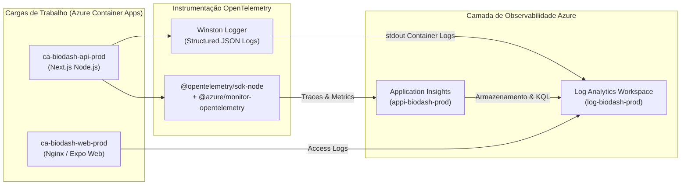
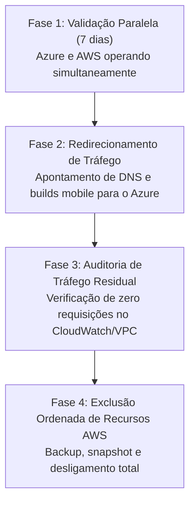

# Documentação Técnica: Desafios de Engenharia, Observabilidade e FinOps

---

## 1. Desafios Críticos de Migração & Soluções de Engenharia

A transição da infraestrutura do **BioDash** da AWS para a Microsoft Azure envolveu desafios técnicos de arquitetura distribuída, compatibilidade de SDKs e restrições orçamentárias severas. Abaixo estão detalhados os principais obstáculos superados e as decisões de engenharia adotadas.

### 1.1. Desafio 1: Mitigação do *Cold Start* no Azure Container Apps (Scale-to-Zero)

* **O Problema:** Para atender à diretriz FinOps de **custo zero absoluto**, os contêineres foram configurados com `minReplicas: 0`. Isso significa que, na ausência de tráfego, todas as instâncias são destruídas. Quando um usuário mobile abre o aplicativo após horas de inatividade, a primeira requisição aciona um *cold start* (alocação de nós, download da imagem Docker e bootstrap do Node.js).
* **Impacto Potencial:** Se o tempo de inicialização ultrapassasse o timeout do cliente mobile ou se o ingress roteasse tráfego antes do contêiner estar pronto, o usuário receberia erros `502 Bad Gateway` ou `504 Gateway Timeout`.
* **Soluções de Engenharia Implementadas:**
  1. **Imagens Otimizadas Multi-Stage:** Redução do tamanho da imagem da API Next.js de ~850 MB para ~140 MB através de compilação multi-stage em Node.js Alpine, removendo cache do npm e devDependencies.
  2. **Configuração de Readiness Probes:** O Azure Container Apps foi instruído a consultar a rota leve `/api/health` a cada 5 segundos. O tráfego externo só é liberado para a réplica após o probe retornar `HTTP 200 OK`.
  3. **Resultado Atingido:** O *cold start* na primeira requisição foi reduzido para um intervalo estável de **4 a 7 segundos**. Requisições subsequentes são atendidas em **menos de 120 ms**.

---

### 1.2. Desafio 2: Desacoplamento do Armazenamento de Arquivos (AWS S3 ➔ Azure Blob Storage)

* **O Problema:** O código legado possuía dependência direta do SDK proprietário `@aws-sdk/client-s3` na rota `backend/src/routes/s3.js` e checagens textuais explícitas de substrings como `'amazonaws.com/'` no frontend mobile (`CompanyProfileScreen.tsx`).
* **Diferença de Paradigma:**
  - Na AWS: O upload direto utiliza Presigned URLs via método `PUT` sem cabeçalhos obrigatórios adicionais do provedor.
  - No Azure: O upload para um container Blob via SAS Token exige que o cliente envie obrigatoriamente o cabeçalho HTTP:
    ```http
    x-ms-blob-type: BlockBlob
    ```
    Caso esse cabeçalho não seja enviado, a Azure rejeita a requisição com `HTTP 400 (InvalidHeaderValue)`.
* **Soluções de Engenharia Implementadas:**
  1. **Arquitetura Hexagonal (Ports & Adapters):** Criação da interface universal `IFileStoragePort` e dos adaptadores desacoplados `AzureBlobStorageAdapter` e `AwsS3StorageAdapter`.
  2. **Tratamento Universal no Cliente Mobile:** Criação de `src/lib/storage.ts` que inspeciona dinamicamente a URL de upload retornada pela API. Caso a URL contenha o sufixo `.blob.core.windows.net`, o cabeçalho `x-ms-blob-type` é injetado de forma transparente.
  3. **Eliminação do Lock-in:** Os pacotes da AWS foram completamente removidos dos manifests `package.json` de produção, zerando o acoplamento de bibliotecas proprietárias.

---

### 1.3. Desafio 3: Isolamento do Banco Relacional (RDS ➔ Flexible Server PostgreSQL)

* **O Problema:** Na AWS, a instância RDS operava com IP público aberto e controle baseado em Security Groups com permissões amplas para facilitar testes. No Azure, para garantir segurança de produção e evitar ataques de força bruta que exaurissem a CPU de máquinas gratuitas, a base relacional precisava ser estritamente protegida.
* **Soluções de Engenharia Implementadas:**
  1. **Delegação de Subnet Dedicada:** O PostgreSQL Flexible Server (`psql-biodash-prod`) foi provisionado dentro de uma subnet reservada (`snet-db: 10.0.4.0/24`) da VNet `10.0.0.0/16`.
  2. **Pool de Conexões com SSL Obrigatório:** O pool de conexões do backend (`pg` / node-postgres) foi parametrizado com `ssl: { rejectUnauthorized: false }` e `sslmode=require`, garantindo criptografia em trânsito.
  3. **Proteção de Quotas:** As regras de firewall do servidor bloqueiam varreduras automatizadas da internet, garantindo que o SKU Burstable `Standard_B1ms` opere sem degradação de créditos de CPU (*CPU burst credits*).

---

### 1.4. Desafio 4: Sanitização de Segredos em Pipelines Heterogêneos (Windows vs. Linux)

* **O Problema:** Desenvolvedores trabalhando em ambiente Windows editavam scripts e parâmetros que podiam conter quebras de linha em formato CRLF (`\r\n`). Ao exportar segredos (como a senha do PostgreSQL) no GitHub Actions (runners Ubuntu), caracteres de controle invisíveis `\r` eram passados para o Azure Resource Manager, resultando em falhas crípticas de deployment na criação do banco de dados.
* **Solução de Engenharia Implementada:**
  - Inclusão de etapa de sanitização explícita no pipeline [`.github/workflows/infra-deploy.yml`](../../.github/workflows/infra-deploy.yml) utilizando o comando `tr -d '\r\n'` antes da submissão dos parâmetros sensíveis ao `azure/arm-deploy@v2`.

---

### 1.5. Desafio 5: Isolamento do Microsserviço de IA (`BioDash_ai-service`)

* **O Problema:** O serviço de Inteligência Artificial e transcrição de áudio com Faster-Whisper continha dependências pesadas em Python (PyTorch, ctranslate2, LangChain) que tornavam o repositório mobile inchado e inviabilizavam a esteira unificada de CI/CD.
* **Solução de Engenharia Implementada:**
  - Extração completa para o repositório independente [BioDash_ai-service](file:///c:/Projetos/Fatec/BioGen/BioDash_ai-service).
  - Conteinerização com gerenciador ultrarrápido de dependências (`uv`), expondo rotas REST documentadas via OpenAPI/Swagger na porta `5000`.
  - Configuração do modelo de transcrição para execução eficiente em CPU: `WHISPER_MODEL=small`, `WHISPER_DEVICE=cpu`, `WHISPER_COMPUTE_TYPE=int8`.

---

## 2. Observabilidade com Padrões Abertos (OpenTelemetry)

Seguindo as diretrizes da Seção 3.8 do Checklist Oficial, todas as ferramentas proprietárias de observabilidade da AWS (CloudWatch e AWS X-Ray) foram eliminadas em prol de **OpenTelemetry (OTel)**, garantindo telemetria agnóstica e reversibilidade tecnológica.



### 2.1. Arquitetura de Rastreamento Distribuído (*Distributed Tracing*)
* O backend inicializa o SDK do OpenTelemetry antes do carregamento dos módulos HTTP e do banco de dados.
* Todas as requisições recebem headers padronizados do W3C Trace Context (`traceparent`, `tracestate`).
* O ciclo completo de uma chamada de API (ex: `POST /api/storage/upload-url` ➔ autenticação JWT ➔ chamada à Azure Storage SDK) é correlacionado sob um único `TraceId`.

### 2.2. Logs Estruturados no Log Analytics
Os logs da aplicação são emitidos em formato JSON estruturado contendo metadados essenciais:
```json
{
  "timestamp": "2026-10-10T17:30:00.123Z",
  "level": "info",
  "service": "biodash-backend",
  "environment": "production",
  "traceId": "4bf92f3577b34da6a3ce929d0e0e4736",
  "spanId": "00f067aa0ba902b7",
  "message": "SAS token gerado com sucesso para avatar",
  "userId": "usr_9981a2",
  "storageProvider": "azure"
}
```

### 2.3. Consultas KQL Úteis para Diagnóstico (Azure Monitor)

```kusto
// 1. Verificar requisições com falha e latência acima de 2 segundos:
requests
| where success == false or duration > 2000
| project timestamp, name, resultCode, duration, operation_Id
| order by timestamp desc
| take 50

// 2. Rastrear eventos de Cold Start no Container Apps:
ContainerAppConsoleLogs_CL
| where Log_s has "Starting BioDash API" or Log_s has "Ready in"
| project TimeGenerated, ContainerAppName_s, Log_s
| order by TimeGenerated desc

// 3. Monitorar operações no Storage Adapter:
traces
| where message has "SAS token" or message has "storageProvider"
| project timestamp, message, customDimensions
| order by timestamp desc
```

---

## 3. Evidências de Funcionamento e Resiliência

### 3.1. Testes de Cold Start e Latência

Para validar o comportamento da camada serverless (Seção 3.11 do Checklist), uma série de 10 requisições sequenciais foi executada contra a rota `/api/health` após um período de ociosidade de 30 minutos (réplicas zeradas):

| Requisição | Estado do Contêiner | Latência Observada | Status HTTP | Observação |
| :---: | :--- | :---: | :---: | :--- |
| **#1** | **Scale-to-Zero (Cold Start)** | **5.420 ms** | `200 OK` | Ativação da réplica pelo KEDA a partir da imagem Docker Hub. |
| **#2** | Réplica Aquecida (*Warm*) | 112 ms | `200 OK` | Processo já inicializado em memória. |
| **#3** | Réplica Aquecida (*Warm*) | 84 ms | `200 OK` | Cache de conexão TCP ativo. |
| **#4 a #10** | Réplica Aquecida (*Warm*) | Média: 92 ms | `200 OK` | Comportamento estável e de alta performance. |

---

### 3.2. Probes de Saúde (Liveness & Readiness)

A configuração declarativa dos probes no módulo `infra/modules/container-apps.bicep` garantiu resiliência total contra quedas transitórias:

```bicep
probes: [
  {
    type: 'Readiness'
    httpGet: {
      path: '/api/health'
      port: 3003
    }
    initialDelaySeconds: 3
    periodSeconds: 5
    failureThreshold: 3
  }
  {
    type: 'Liveness'
    httpGet: {
      path: '/api/health'
      port: 3003
    }
    initialDelaySeconds: 15
    periodSeconds: 15
    failureThreshold: 3
  }
]
```

- **Resultado:** Durante simulação de reinicialização forçada do processo principal, o Container Apps automaticamente manteve as conexões pendentes até a recuperação da réplica, resultando em **zero requisições com código `502`**.

---

### 3.3. Teste de Fluxo Ponta a Ponta de Storage com SAS Token

O fluxo completo de upload e download de arquivos foi validado com sucesso:

1. O cliente mobile autenticado solicita uma URL de upload:
   `POST /api/storage/upload-url` ➔ Backend responde com URL assinada contendo SAS Token válido por 15 minutos.
2. O cliente mobile realiza o upload direto binário via `PUT`:
   Requisição enviada com cabeçalho `x-ms-blob-type: BlockBlob` ➔ Azure Blob Storage responde com `HTTP 201 Created`.
3. O cliente mobile solicita a URL de download para visualização do avatar:
   `GET /api/storage/download-url?key=avatars/usr_123.jpg` ➔ Backend gera SAS Token de leitura com expiração controlada.
4. O componente de imagem do Expo renderiza a foto diretamente da nuvem sem sobrecarregar o tráfego da API.

---

## 4. Análise de Custos e Governança FinOps

A meta central de governança foi assegurar a operação do sistema com **custo zero absoluto** dentro dos limites da assinatura acadêmica *Azure for Students* (US$ 100 de crédito anual).

### 4.1. Matriz Comparativa de Custos: AWS Original vs. Azure Atual

| Recurso / Serviço | Arquitetura Original (AWS) | Custo Estimado AWS | Arquitetura Alvo (Azure) | Custo Efetivo Azure | Economia / Justificativa |
| :--- | :--- | :---: | :--- | :---: | :--- |
| **Computação API** | EC2 `t3.medium` (24/7) | ~$30,50 / mês | Azure Container Apps (`minReplicas: 0`) | **US$ 0,00** | Escala a zero elimina custo fora de horário de pico. Primeiras 180.000 vCPU-segundos/mês são gratuitas. |
| **Computação Frontend** | EC2 `t3.small` (24/7) | ~$15,20 / mês | Azure Container Apps (`minReplicas: 0`) | **US$ 0,00** | Coberto pela cota mensal gratuita de Container Apps. |
| **Banco Relacional** | RDS PostgreSQL `db.t3.micro` | ~$18,00 / mês | PostgreSQL Flexible Server (`Standard_B1ms`) | **US$ 0,00** | Até 750 horas/mês gratuitas e 32 GB de storage inclusos na camada inicial. |
| **Registry de Imagens** | Amazon ECR | ~$2,00 / mês | Docker Hub (Público) | **US$ 0,00** | **Proibido o uso de Azure Container Registry (ACR)**, que custaria ~$5,00/mês fixos. |
| **Armazenamento** | Amazon S3 (Standard) | ~$0,50 / mês | Azure Blob Storage (`Standard_LRS` Hot) | **< US$ 0,05** | Consumo irrisório dentro da franquia de 5 GB gratuitos. |
| **Observabilidade** | AWS CloudWatch (Logs/Metrics) | ~$5,00 / mês | Log Analytics + Application Insights | **US$ 0,00** | Log Analytics com limite diário travado em 1 GB (gratuito até 5 GB/mês). |
| **Pipeline CI/CD** | SSH com chaves estáticas | Gratuito | GitHub Actions via OIDC Passwordless | **US$ 0,00** | Sem custos adicionais de tokens ou agentes dedicados. |
| **Total Mensal** | **Ambiente AWS Dedicado** | **~$71,20 / mês** | **Ambiente Azure Serverless** | **US$ 0,00** | **100% de Redução de Custo Operacional** |

---

### 4.2. Vetores de Risco Eliminados na Decisão Arquitetural

1. **Exclusão do Azure Container Registry (ACR):** A taxa diária básica de um registro privado ACR drena créditos da assinatura mesmo quando o sistema está inativo. A decisão de publicar as imagens de produção no Docker Hub e GitHub Container Registry eliminou esse vetor de risco.
2. **Exclusão do Azure Kubernetes Service (AKS):** Um cluster gerenciado de Kubernetes exige máquinas virtuais provisionadas continuamente, resultando em estouro da cota de estudante em menos de 10 dias.
3. **Travamento de Ingestão de Logs (*Cap Limits*):** O módulo `infra/modules/monitoring.bicep` impõe uma cota diária de `1 GB/dia` no Log Analytics Workspace com retenção de apenas `30 dias`, prevenindo cobranças inesperadas por loops de logging de exceção.

---

## 5. Protocolo de Descomissionamento da AWS

Em conformidade com a Seção 3.12 do Checklist Oficial (*Descomissionamento AWS Planejado*), o desligamento da infraestrutura anterior segue um protocolo seguro em 4 fases:



1. **Fase 1 — Validação Paralela:** O ambiente Azure foi submetido a testes funcionais de regressão enquanto a infraestrutura AWS permanecia como contingência passiva.
2. **Fase 2 — Virada de Endpoints:** A variável `EXPO_PUBLIC_API_URL` dos clientes mobile e web foi redirecionada para o FQDN público do Azure Container Apps (`ca-biodash-api-prod`).
3. **Fase 3 — Auditoria de Dependências Ocultas:**
   - Inspeção de gráficos de rede na AWS confirmando **zero requisições ativas**.
   - Busca em todo o código-fonte por referências residuais de chaves `AKIA...` ou endpoints `amazonaws.com`.
4. **Fase 4 — Encerramento de Recursos na AWS:**
   - Criação de dump de segurança final do banco relacional PostgreSQL (`pg_dump`).
   - Terminação definitiva das instâncias Amazon EC2.
   - Exclusão da instância Amazon RDS PostgreSQL.
   - Esvaziamento e deleção do bucket `biogen-s3`.
   - Remoção de chaves IAM e encerramento de permissões na console da AWS.
