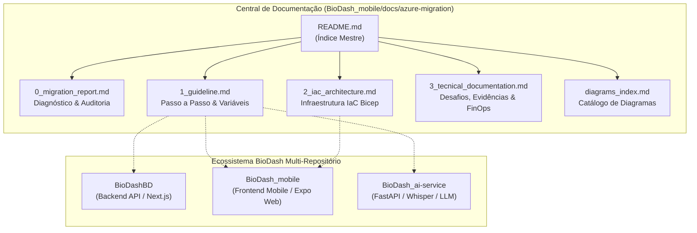

# Migração de Infraestrutura

---

## 📌 1. Visão Geral e Propósito

Este diretório centraliza **toda a documentação técnica, arquitetural, operacional e visual** referente ao processo de migração da infraestrutura do ecossistema **BioDash** da *Amazon Web Services (AWS)* para o ecossistema *Microsoft Azure*.

A transição foi conduzida com foco no **desacoplamento arquitetural (Clean Architecture / Ports & Adapters)**, **Infraestrutura como Código (IaC com Bicep)**, **esteira de entrega contínua sem credenciais estáticas (GitHub Actions via OIDC Passwordless)**, **observabilidade agnóstica (OpenTelemetry)** e **rigorosa governança de custos (FinOps)** para operação com custo zero dentro da assinatura acadêmica.



---

## 📚 2. Estrutura e Divisão dos Documentos

Para atender com máxima rastreabilidade às seções do **Checklist Oficial do Projeto** e aos critérios de avaliação da banca acadêmica, o corpus documental é estruturado em **5 pilares complementares**:

| Arquivo | Nome do Documento | Foco Principal | Checklist Vinculado |
| :--- | :--- | :--- | :--- |
| [**`0_migration_report.md`**](./0_migration_report.md) | **Diagnóstico Arquitetural Inicial & Lock-in** | Auditoria de acoplamento da AWS, framework dos 6 R's, isolamento de domínio e blindagem arquitetural. | Seções 3.1, 3.2 |
| [**`1_guideline.md`**](./1_guideline.md) | **Guia Operacional Passo a Passo** | Guia de execução de deploy no Azure, matriz de variáveis de ambiente por repositório e setup local. | Seções 3.3, 3.5, 3.10, 8.2 |
| [**`2_iac_architecture.md`**](./2_iac_architecture.md) | **Arquitetura de Infraestrutura como Código (IaC)** | Topologia declarativa Bicep, rede (VNet/NSG), Container Apps com scale-to-zero, PostgreSQL e CI/CD OIDC. | Seções 3.4, 3.5, 3.6, 3.9, 3.10 |
| [**`3_tecnical_documentation.md`**](./3_tecnical_documentation.md) | **Documentação Técnica, Desafios & FinOps** | Desafios de migração superados, evidências de telemetria OTel/Azure Monitor, cold start e análise FinOps. | Seções 3.8, 3.11, 3.12, 8.3 |
| [**`diagrams_index.md`**](./diagrams_index.md) | **Catálogo e Índice Geral de Diagramas** | Índice visual unificado de todos os diagramas de arquitetura (Antes/Depois, Hexagonal, Rede, OIDC, OTel). | Seções 8.2, 7 |

---

## 🔎 3. Ementa Detalhada de Cada Documento

### 📑 [0_migration_report.md](./0_migration_report.md) — Diagnóstico Arquitetural Inicial
* **Objetivo:** Documentar o inventário exaustivo da arquitetura pré-existente na AWS, diagnosticar o grau de acoplamento técnico a SDKs proprietários e definir a estratégia formal de transição tecnológica.
* **Tópicos Chave:**
  - **Inventário de Serviços AWS:** Compute (EC2, Lambda), Data (RDS PostgreSQL, S3, MongoDB), Rede (VPC, Security Groups), IAM (Instance Profiles, static keys) e CI/CD.
  - **Classificação de Acoplamento:** Mapeamento em 3 categorias (*Agnóstico*, *Levemente Acoplado* e *Altamente Acoplado*).
  - **Estratégia dos 6 R's de Migração:** Enquadramento de cada serviço em *Refactor* (S3 ➔ Blob com Ports & Adapters, Telemetria ➔ OpenTelemetry) ou *Replatform* (EC2 ➔ Azure Container Apps, RDS ➔ Azure Flexible Server).
  - **Blindagem contra Lock-in:** Padrão Ports & Adapters para Storage (`IFileStoragePort`), Mensageria e Configurações sensíveis externalizadas.
* **Marcos Vinculados:** Marco 1 e Marco 2.

---

### 📘 [1_guideline.md](./1_guideline.md) — Guia Passo a Passo & Setup Operacional
* **Objetivo:** Fornecer um roteiro técnico reproduzível contendo instruções para execução local, provisionamento e deploy automatizado no Azure para todos os repositórios do ecossistema.
* **Tópicos Chave:**
  - **Guia de Execução Local:** Inicialização de `BioDashBD` (Next.js), `BioDash_mobile` (Expo/React Native) e `BioDash_ai-service` (Python/FastAPI) em modo de desenvolvimento ou via Docker Compose.
  - **Matriz de Variáveis de Ambiente:** Dicionário de variáveis necessárias para cada repositório (`.env.example` explicado), detalhando chaves de banco, JWT, endpoints e storage.
  - **Roteiro de Deploy no Azure:** Execução do fluxo de CI/CD automatizado via GitHub Actions ou disparo manual via Azure CLI (`az deployment group create`).
  - **Estratégia de Registry Sem Custos:** Fluxo de compilação e publicação de imagens de contêiner no GitHub Container Registry (GHCR) e Docker Hub, eliminando o Azure Container Registry (ACR).
* **Marcos Vinculados:** Marco 2, Marco 3 e Seção 8.2 das diretrizes.

---

### 🏗️ [2_iac_architecture.md](./2_iac_architecture.md) — Documentação de Arquitetura IaC (Bicep)
* **Objetivo:** Apresentar a especificação completa da infraestrutura declarativa provisionada via Microsoft Azure Bicep, detalhando os módulos, a topologia de rede e a segurança passwordless.
* **Tópicos Chave:**
  - **Estrutura Modular de IaC:** Padrão Hub & Spoke com arquivo mestre `infra/main.bicep` e módulos especializados em `infra/modules/` (`network`, `storage`, `database`, `monitoring`, `container-apps`, `identity`).
  - **Topologia de Rede & Isolamento:** Virtual Network (VNet), sub-redes delegadas, regras restritivas de Network Security Group (NSG) e controle de tráfego.
  - **Camada Serverless de Contêineres:** Azure Container Apps (ACA) com autoscaling gerenciado por KEDA, *Scale-to-Zero* (`minReplicas: 0`) e probes de *Liveness* e *Readiness*.
  - **Autenticação OIDC & Zero Secrets:** Integração federada entre GitHub Actions e Microsoft Entra ID via `azure/arm-deploy@v2`, dispensando chaves estáticas de longa duração.
  - **Managed Identity & RBAC:** Identidade gerenciada atribuída ao usuário (`id-biodash-prod`) com papel *Storage Blob Data Contributor* para acesso seguro aos Blobs.
* **Marcos Vinculados:** Marco 3 e Marco 4.

---

### 📊 [3_tecnical_documentation.md](./3_tecnical_documentation.md) — Desafios Técnicos, Telemetria & FinOps
* **Objetivo:** Consolidar a documentação técnica avançada, detalhando os desafios de engenharia superados durante a migração, as evidências de observabilidade ponta a ponta e a análise orçamentária FinOps.
* **Tópicos Chave:**
  - **Desafios Críticos de Migração:**
    - Tratamento de *Cold Start* em Container Apps escalados a zero.
    - Resolução de políticas de CORS e cabeçalhos no upload direto para Azure Blob Storage (`x-ms-blob-type: BlockBlob`).
    - Compatibilidade de bibliotecas e conectores (PostgreSQL Flexible Server vs. RDS).
    - Sanitização de quebras de linha (`\r\n`) em segredos injetados por pipelines multiplataforma (Windows/Linux).
  - **Observabilidade Vendor-Neutral (OpenTelemetry):** Instrumentação do backend com SDKs OTel, ingestão no Azure Monitor / Application Insights e eliminação do AWS CloudWatch.
  - **Evidências de Funcionamento:** Logs estruturados, métricas de tráfego, rastreamento distribuído (*distributed tracing*) e testes de validação funcional.
  - **Análise de Custos FinOps:** Matriz de custos comprovando a operação com **custo zero absoluto** na assinatura *Azure for Students* (justificativas para exclusão de ACR, exclusão de AKS e adoção de tiers Burstable e Serverless).
  - **Descomissionamento Planejado da AWS:** Procedimento de encerramento seguro e corte total de dependências com a AWS.
* **Marcos Vinculados:** Marco 4, Marco 5 e Seção 8.3 das diretrizes.

---

### 🎨 [diagrams_index.md](./diagrams_index.md) — Catálogo e Índice Geral de Diagramas
* **Objetivo:** Reunir e catalogar todos os diagramas visuais e conceituais criados para o projeto, organizados por domínio arquitetural.
* **Tópicos Chave:**
  - **Diagrama de Arquitetura Comparativo:** *Antes (AWS Monolítico/VMs)* vs. *Depois (Azure Serverless/Modular)*.
  - **Diagrama de Arquitetura Hexagonal:** Portas e Adaptadores de Storage (`IFileStoragePort` ➔ `AzureBlobStorageAdapter` / `AwsS3StorageAdapter`).
  - **Diagrama de Rede e Segurança:** Topologia VNet, sub-redes privadas/públicas, NSGs e regras de firewall do PostgreSQL Flexible Server.
  - **Diagrama da Esteira CI/CD com OIDC:** Fluxo passo a passo de autenticação federada passwordless entre GitHub Actions, Microsoft Entra ID e Azure ARM.
  - **Diagrama de Observabilidade OTel:** Ciclo de vida da telemetria (rastros, métricas e logs) emitidos pelas aplicações para o Application Insights.
* **Marcos Vinculados:** Transversal a todos os marcos e Seção 8.2 das diretrizes.

---

## 🌐 4. Centralização e Ecossistema Multi-Repositório

O projeto acadêmico **BioGen / BioDash** é composto por três frentes de código distribuídas:

```
c:\Projetos\Fatec\BioGen\
├── BioDash_mobile/          # REPOSITÓRIO CENTRALIZADOR DE GOVERNANÇA, IaC E DOCS
│   ├── docs/azure-migration/# 📍 Pasta onde residem todas as documentações e diagramas
│   ├── infra/               # Templates IaC em Azure Bicep e scripts de automação
│   └── src/                 # Aplicação Mobile e Web em Expo / React Native
│
├── BioDashBD/               # Backend API Oficial em Next.js (Node.js/TypeScript)
│   ├── lib/storage/         # Implementação de Ports & Adapters para Storage (Azure Blob / S3)
│   └── app/api/             # Rotas REST e instrumentação OpenTelemetry
│
└── BioDash_ai-service/      # Microsserviço Especializado de Inteligência Artificial
    ├── app/                 # FastAPI + Faster-Whisper + LangChain
    └── Dockerfile           # Imagem conteinerizada publicada no Docker Hub
```

---

## 🏆 5. Alinhamento com a Rúbrica de Avaliação Oficial

A organização desta documentação cobre integralmente os **5 critérios de excelência** (pontuação máxima: 10/10) descritos na Seção 7 das diretrizes:

| Dimensão Avaliada | Critério de Excelência (2,0 pts) | Documento Comprobatório Principal |
| :--- | :--- | :--- |
| **1. Desacoplamento** | Domínio isolado; Adapters claros; zero SDK proprietário no core da aplicação. | [`0_migration_report.md`](./0_migration_report.md) & [`diagrams_index.md`](./diagrams_index.md) |
| **2. Governança / FinOps** | Custo zero; serviços gratuitos bem dimensionados; exclusão de ACR e AKS; zero desperdício de créditos. | [`3_tecnical_documentation.md`](./3_tecnical_documentation.md) |
| **3. Observabilidade** | Full OpenTelemetry; traces distribuídos e logs estruturados no Azure Monitor / Application Insights. | [`3_tecnical_documentation.md`](./3_tecnical_documentation.md) |
| **4. IaC e Automação** | Infra 100% via código declarativo (Bicep); CI/CD via OIDC Passwordless; deploy contínuo sem intervenção manual. | [`2_iac_architecture.md`](./2_iac_architecture.md) & [`1_guideline.md`](./1_guideline.md) |
| **5. Execução Técnica** | Migração limpa; alta resiliência; cold start mitigado; corte definitivo e documentado da AWS. | [`1_guideline.md`](./1_guideline.md) & [`3_tecnical_documentation.md`](./3_tecnical_documentation.md) |

---

> [!TIP]
> Para navegar pelos subdocumentos, utilize os links diretos na tabela da [Seção 2](#-2-estrutura-e-divisão-dos-documentos) ou acesse o sumário de diagramas em [**`diagrams_index.md`**](./diagrams_index.md).
