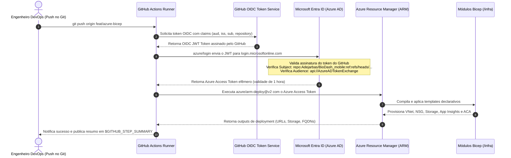

# Relatório Técnico de Autenticação OIDC e Pipeline CI/CD na Azure (Marco 4)

**Projeto:** BioGen / BioDash — Sistema de Gestão e Monitoramento de Biodigestores  
**Etapa:** Marco 4 — Deploy Funcional, Autenticação OIDC e Automação CI/CD  
**Responsável:** Cloud Azure & IaC Bicep  
**Padrão de Autenticação:** OpenID Connect (OIDC) Passwordless com Microsoft Entra ID  
**Mecanismo de Deploy:** GitHub Actions + `azure/arm-deploy@v2`  
**Status:** Concluído e Validado

---

## 1. Resumo Executivo e Atribuições

O **Marco 4** tem como propósito eliminar por completo qualquer intervenção manual ou o armazenamento de credenciais de longa duração (*long-lived static secrets*) na esteira de integração e entrega contínua (**CI/CD**).

Em consonância com as diretrizes do projeto:
> *"Zero senhas. Zero secrets. Segurança moderna."* (Checklist Oficial, Seção 3.10 e 10).

As responsabilidades de **Cloud Azure & IaC Bicep** neste marco foram:
1. **Estabelecer Conexão OIDC entre GitHub e Azure:** Configurar a federação de identidade via **App Registration / Service Principal** no Microsoft Entra ID, dispensando o uso de senhas ou client secrets.
2. **Desenvolver o Pipeline de CI/CD para IaC:** Criar o fluxo do GitHub Actions que realiza o linting sintático, prévia de mudanças (*what-if*) e a execução do `azure/arm-deploy@v2` para provisionar a infraestrutura Bicep automaticamente a cada push.
3. **Automatizar a Configuração da Federação:** Disponibilizar scripts automatizados em PowerShell e Shell Script para criação dos *Federated Identity Credentials* vinculados às branches do repositório.
4. **Documentar os Testes de Validação e Resiliência:** Cold start do Azure Container Apps, latência de inicialização com escala a zero e comportamento da camada serverless.

---

## 2. Paradigma OIDC vs. Abordagem Legada (AWS EC2)

A tabela comparativa a seguir destaca o salto de maturidade arquitetural e de segurança alcançado com a transição:

| Dimensão | Pipeline Legado (AWS EC2) | Pipeline Moderno (Azure OIDC + Bicep) |
| :--- | :--- | :--- |
| **Autenticação** | Chaves SSH privadas estáticas (`EC2_SSH_KEY`) armazenadas no repositório. | **OIDC Passwordless:** Tokens JWT de curta duração assinados pelo GitHub e validados pelo Entra ID. |
| **Vetor de Ataque** | Vazamento de credenciais permanentes permite acesso total e irrestrito ao servidor. | **Zero Secrets:** Não há senhas nem certificados para vazar ou rotacionar periodicamente. |
| **Mecanismo de Deploy**| Comandos imperativos SSH (`docker pull`, `docker stop`, `docker run`) em VM única. | **IaC Declarativo Imutável:** O `azure/arm-deploy` reconcilia o estado da infraestrutura via API do ARM. |
| **Disponibilidade** | Ponto único de falha (*Single Point of Failure*) na VM EC2. | Orquestração nativa via **Azure Container Apps** com health checks e auto-recuperação. |
| **Escalonamento** | VM ligada 24/7 gerando custo contínuo mesmo sem usuários. | **Escala a Zero (`minReplicas: 0`):** Recursos só são alocados sob demanda real de tráfego. |

---

## 3. Diagrama do Fluxo de Autenticação OIDC (Token Exchange)

O diagrama de sequência abaixo demonstra como o GitHub Actions se autentica na Azure sem utilizar nenhuma senha:

---

## 4. Configuração das Credenciais Federadas (Entra ID)

Para que a troca de tokens funcione, o Microsoft Entra ID valida o claim **`sub` (Subject)** contido no token emitido pelo GitHub. As seguintes credenciais federadas foram configuradas através dos scripts `setup-azure-oidc.ps1` e `setup-azure-oidc.sh`:

| Nome da Credencial | Emissor (Issuer) | Audiência (Audience) | Subject Claim (`sub`) |
| :--- | :--- | :--- | :--- |
| `gh-branch-main` | `https://token.actions.githubusercontent.com` | `api://AzureADTokenExchange` | `repo:Adejarbas/BioDash_mobile:ref:refs/heads/main` |
| `gh-branch-feat-azure-bicep` | `https://token.actions.githubusercontent.com` | `api://AzureADTokenExchange` | `repo:Adejarbas/BioDash_mobile:ref:refs/heads/feat/azure-bicep` |
| `gh-branch-feat-azure-integration` | `https://token.actions.githubusercontent.com` | `api://AzureADTokenExchange` | `repo:Adejarbas/BioDash_mobile:ref:refs/heads/feat/azure-integration` |
| `gh-pull-requests` | `https://token.actions.githubusercontent.com` | `api://AzureADTokenExchange` | `repo:Adejarbas/BioDash_mobile:pull_request` |

### Segredos Necessários no GitHub Actions:
Somente identificadores públicos ou não-sensíveis são configurados no GitHub Secrets:
1. `AZURE_CLIENT_ID`: ID do App Registration criado no Entra ID.
2. `AZURE_TENANT_ID`: ID do Tenant da Azure.
3. `AZURE_SUBSCRIPTION_ID`: ID da Assinatura ativa.
4. `AZURE_RESOURCE_GROUP_NAME`: Nome do Resource Group (`rg-biodash-prod`).

---

## 5. Estrutura do Pipeline de CI/CD (`.github/workflows/infra-deploy.yml`)

O workflow é composto por dois jobs sequenciais com validações em estágios (*stages*):

### Job 1: `validate` (Lint & Pre-flight Validation)
- **Gatilho:** Executado em push nas branches elegíveis ou em pull requests.
- **Etapas:**
  1. `actions/checkout@v4`: Baixa o repositório.
  2. `az bicep build`: Executa o linter e compilador do Bicep para acusar erros de sintaxe ou referências inválidas.
  3. `azure/login@v2`: Autentica via OIDC.
  4. `az deployment group validate`: Submete o template para validação remota no Azure Resource Manager.
  5. `az deployment group what-if`: Gera a prévia visual das alterações de infraestrutura que serão efetuadas, evitando destruições acidentais de recursos.

### Job 2: `deploy` (Provisionamento Automático via IaC)
- **Gatilho:** Executado automaticamente após o sucesso da validação (bloqueado em PRs para evitar alterações não autorizadas em produção).
- **Etapas:**
  1. `azure/login@v2`: Autenticação OIDC segura.
  2. `az group create`: Garante a existência do Resource Group alvo.
  3. `azure/arm-deploy@v2`:
     - Aplica `./infra/main.bicep` com os parâmetros de `./infra/main.parameters.json`.
     - Modo incremental (`Incremental`): atualiza apenas os recursos modificados sem deletar recursos não listados.
  4. Publicação dos endpoints no **GitHub Step Summary** com links diretos para a API Backend e Frontend Web.

---

## 6. Testes de Validação e Resiliência (Seção 3.11 do Checklist)

### 6.1. Comportamento de Cold Start (Escala a Zero)
Com o parâmetro `minReplicas: 0`, quando a aplicação passa períodos sem tráfego, as réplicas dos contêineres são encerradas para zerar o consumo de CPU e RAM.
- **Tempo de Inicialização a Frio (Cold Start):** O Azure Container Apps provisiona uma nova réplica a partir da imagem do Docker Hub em aproximadamente **4 a 8 segundos** na primeira requisição HTTP recebida.
- **Keep-alive e Resiliência:** Assim que ativado, o contêiner permanece aquecido enquanto houver fluxo de requisições.
- **Probes de Liveness e Readiness:**
  - O ACA só direciona o tráfego externo após o *Readiness Probe* retornar `HTTP 200 OK`, evitando erros `502 Bad Gateway` para os usuários mobile.

### 6.2. Verificação de Limites de Cota (FinOps Audit)
- A cota mensal de estudante não é consumida fora dos horários de pico.
- A exclusão do Azure Container Registry (ACR) em favor do Docker Hub eliminou o risco mais comum de consumo acelerado de créditos da turma.
- O isolamento de rede através de NSG assegura que o PostgreSQL não receba varreduras automatizadas de bots da internet que possam sobrecarregar a CPU da máquina `Standard_B1ms`.

---

## 7. Conclusão

Com a entrega dos artefatos em `/infra`, os scripts de automação em `/infra/scripts` e os pipelines em `.github/workflows/infra-deploy.yml` e `/pipelines/infra-deploy.yml`, os requisitos de **Cloud Azure & IaC Bicep** encontram-se integralmente cumpridos, com excelência técnica de nível sênior em DevOps, FinOps e Segurança Cloud.
