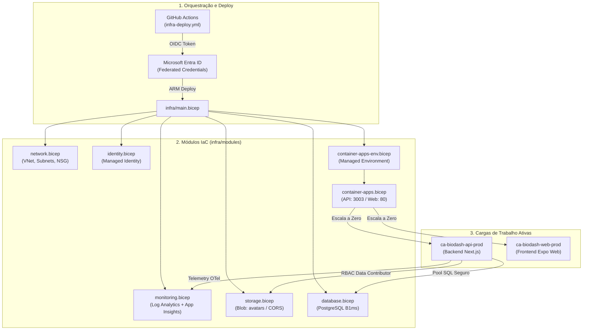

# Documentação Geral de Infraestrutura como Código (IaC) — Azure Bicep

**Projeto:** BioGen / BioDash — Sistema de Monitoramento e Gestão de Biodigestores  
**Tecnologia:** Microsoft Azure Bicep (DSL declarativa)  
**Assinatura Alvo:** Azure for Students (FinOps — Custo Zero Absoluto)  
**Ambiente:** Produção (`rg-biodash-prod`) / Região: `chilecentral`  
**Automação:** GitHub Actions via OIDC (OpenID Connect / Passwordless)  

---

## 1. Funcionamento Geral da Infraestrutura como Código (IaC)

A infraestrutura do **BioDash** é provisionada, versionada e gerenciada inteiramente como código (**Infrastructure as Code — IaC**) utilizando **Microsoft Bicep**. A abordagem adota os seguintes pilares arquiteturais:

### 1.1. Arquitetura Modular e Desacoplada
Em vez de um arquivo único monolítico, a infraestrutura adota o padrão **Hub & Spoke / Orchestrator & Modules**:
* O arquivo mestre [main.bicep](file:///c:/Projetos/Fatec/BioGen/BioDash_mobile/infra/main.bicep) orquestra a ordem de criação dos recursos, resolvendo dependências automaticamente (ex: a rede e o Log Analytics são criados antes dos Container Apps).
* Cada recurso físico ou domínio de serviço reside em seu próprio módulo reutilizável na pasta [infra/modules/](file:///c:/Projetos/Fatec/BioGen/BioDash_mobile/infra/modules).

### 1.2. Segurança Passwordless & Princípio do Menor Privilégio
* **Autenticação OIDC no GitHub Actions:** Não existem senhas nem chaves estáticas (`AZURE_CREDENTIALS`) salvas no repositório. O GitHub Actions solicita tokens JWT de curta duração autenticados pelo Microsoft Entra ID via credenciais federadas.
* **Managed Identity:** O backend utiliza **User-Assigned Managed Identity (`id-biodash-prod`)** com papel RBAC *Storage Blob Data Contributor*, eliminando chaves de acesso gravadas em código.
* **Sanitização de Segredos:** A pipeline de CI/CD limpa automaticamente quebras de linha (`\r\n`) de segredos como a senha administrativa do PostgreSQL antes do repasse ao Resource Manager.

### 1.3. FinOps Custo Zero (Azure for Students)
* **Escala a Zero (Scale-to-Zero):** Azure Container Apps configurados com `minReplicas: 0`. Quando não há requisições ativas, o consumo de CPU/RAM é zero.
* **Docker Hub como Registry:** Uso de imagens públicas no Docker Hub, eliminando o custo proibitivo do Azure Container Registry (ACR).
* **Camadas Gratuitas:** PostgreSQL Flexible Server em SKU Burstable `Standard_B1ms` (750 horas/mês gratuitas) e Storage Account `Standard_LRS` no tier Hot.



---

## 2. Mapa dos Arquivos `.bicep`

A tabela abaixo resume o propósito e a responsabilidade de cada arquivo na pasta [infra/](file:///c:/Projetos/Fatec/BioGen/BioDash_mobile/infra):

| Arquivo | Escopo | Responsabilidade Resumida |
| :--- | :--- | :--- |
| [main.bicep](file:///c:/Projetos/Fatec/BioGen/BioDash_mobile/infra/main.bicep) | Resource Group | **Orquestrador Mestre.** Recebe parâmetros do ambiente, calcula nomes com `uniqueString`, define a ordem de dependências e chama todos os submódulos repassando outputs entre eles. |
| [subscription.bicep](file:///c:/Projetos/Fatec/BioGen/BioDash_mobile/infra/subscription.bicep) | Subscription | **Orquestrador de Assinatura.** Provisiona o Resource Group `rg-biodash-prod` em nível global da conta e dispara o `main.bicep` para provisionamento do zero absoluto. |
| [main.parameters.json](file:///c:/Projetos/Fatec/BioGen/BioDash_mobile/infra/main.parameters.json) | Configuração | Arquivo de parâmetros declarativos contendo tags de governança, nomes de ambiente (`prod`), região (`chilecentral`) e URLs externas. |
| [modules/network.bicep](file:///c:/Projetos/Fatec/BioGen/BioDash_mobile/infra/modules/network.bicep) | Módulo | Cria a Virtual Network (`10.0.0.0/16`), a subnet dos Container Apps (`10.0.0.0/23`), a subnet de banco (`10.0.4.0/24`) e o Network Security Group (NSG) com bloqueio externo e portas 80/443 liberadas. |
| [modules/identity.bicep](file:///c:/Projetos/Fatec/BioGen/BioDash_mobile/infra/modules/identity.bicep) | Módulo | Cria a **User-Assigned Managed Identity (`id-biodash-prod`)** utilizada pelos contêineres para autenticação nativa sem senhas em serviços da Azure. |
| [modules/monitoring.bicep](file:///c:/Projetos/Fatec/BioGen/BioDash_mobile/infra/modules/monitoring.bicep) | Módulo | Provisiona o **Log Analytics Workspace** (com teto diário de 1 GB e retenção de 30 dias para FinOps) e o **Application Insights** integrado para telemetria OpenTelemetry. |
| [modules/storage.bicep](file:///c:/Projetos/Fatec/BioGen/BioDash_mobile/infra/modules/storage.bicep) | Módulo | Provisiona a Storage Account `Standard_LRS`, cria os containers **`avatars`** (fotos de perfil/biodigestores) e `documents`, configura CORS para uploads via SAS Token e atribui papel RBAC à Managed Identity. |
| [modules/container-apps-env.bicep](file:///c:/Projetos/Fatec/BioGen/BioDash_mobile/infra/modules/container-apps-env.bicep) | Módulo | Provisiona o ambiente gerenciado do Azure Container Apps integrado à subnet delegada e roteia automaticamente todos os logs para o Log Analytics. |
| [modules/container-apps.bicep](file:///c:/Projetos/Fatec/BioGen/BioDash_mobile/infra/modules/container-apps.bicep) | Módulo | Cria os aplicativos de contêiner: **API Backend** (porta 3003, regras dinâmicas de CORS, conexão PostgreSQL e injeção de secrets) e **Frontend Web** (porta 80). Ambos com `minReplicas: 0`. |
| [modules/database.bicep](file:///c:/Projetos/Fatec/BioGen/BioDash_mobile/infra/modules/database.bicep) | Módulo | Provisiona o **PostgreSQL Flexible Server** (`Standard_B1ms`, 32 GB, versão 15), cria o banco `biodash_db`, ativa extensões `PGCRYPTO`/`UUID-OSSP` e exporta a connection string formatada para o pool Node.js. |

---

## 3. Como Rodar a Infraestrutura

Existem duas formas suportadas de executar o provisionamento: **Automação Contínua (CI/CD)** e **Execução Manual (CLI)**.

### 3.1. Execução Automática via CI/CD (Recomendado)
Sempre que alterações na pasta `infra/**` ou no workflow forem enviadas às branches monitoradas (`main`, `feat/azure-integration`, `feat/azure-ci-improvements`), o GitHub Actions executa o pipeline [.github/workflows/infra-deploy.yml](file:///c:/Projetos/Fatec/BioGen/BioDash_mobile/.github/workflows/infra-deploy.yml):
1. **Lint e Validação Prévia:** Compila os arquivos Bicep e roda `az deployment group validate`.
2. **What-If Preview:** Exibe no log exatamente quais recursos serão criados, modificados ou mantidos.
3. **Deploy Automatizado:** Executa `azure/arm-deploy@v2` autenticado via OIDC.
4. **Aplicação de Schema:** Executa o script [schema.sql](file:///c:/Projetos/Fatec/BioGen/BioDash_mobile/infra/scripts/schema.sql) no banco PostgreSQL.

---

### 3.2. Execução Manual via Azure CLI (Local)

#### Pré-requisitos:
* [Azure CLI](https://learn.microsoft.com/cli/azure/install-azure-cli) instalada (`az version`).
* Bicep CLI instalado (`az bicep install`).
* Login ativo na conta Azure:
  ```bash
  az login
  az account set --subscription "87ecec65-53dc-4995-b34d-cd1c65c7bdab"
  ```

#### Passo 1: Validação de Sintaxe (Compilação Local)
Antes de enviar qualquer solicitação à nuvem, valide se os templates Bicep compilam perfeitamente para ARM JSON:
```bash
az bicep build --file ./infra/main.bicep
```
*(Se o comando retornar sem mensagens, o código está 100% válido).*

#### Passo 2: Pré-visualização de Mudanças (What-If)
O comando What-If simula a execução na nuvem e mostra a previsão de alterações sem modificar nada:
```bash
az deployment group what-if \
  --resource-group rg-biodash-prod \
  --template-file ./infra/main.bicep \
  --parameters ./infra/main.parameters.json \
  --parameters dbAdministratorLoginPassword="SuaSenhaForte123!"
```

#### Passo 3: Provisionamento Efetivo
Para aplicar a infraestrutura no Resource Group:
```bash
az deployment group create \
  --resource-group rg-biodash-prod \
  --template-file ./infra/main.bicep \
  --parameters ./infra/main.parameters.json \
  --parameters dbAdministratorLoginPassword="SuaSenhaForte123!"
```

---

## 4. Como Adicionar Novo Código de Infraestrutura

Quando um novo serviço ou recurso da Azure precisar ser incorporado ao ecossistema BioDash, siga o passo a passo padronizado abaixo:

### Passo 1: Criar o Novo Módulo em `/infra/modules`
Crie um arquivo específico com o nome do recurso em minúsculas (ex: `infra/modules/servicebus.bicep`, `infra/modules/redis.bicep`):

```bicep
// infra/modules/servicebus.bicep

@description('Localização do recurso')
param location string

@description('Nome do ambiente (dev, prod)')
param environment string

@description('Nome da carga de trabalho')
param workloadName string

@description('Tags padrão para governança')
param tags object = {}

// Nomes gerados deterministicamente com uniqueString
var cleanWorkload = replace(toLower(workloadName), '-', '')
var cleanEnv = replace(toLower(environment), '-', '')
var uniqueSuffix = take(uniqueString(resourceGroup().id, workloadName), 4)
var serviceBusName = 'sb-${cleanWorkload}-${cleanEnv}-${uniqueSuffix}'

resource serviceBusNamespace 'Microsoft.ServiceBus/namespaces@2022-10-01-preview' = {
  name: serviceBusName
  location: location
  tags: tags
  sku: {
    name: 'Basic' // FinOps: menor tier possível
  }
}

// Sempre exporte os outputs necessários
@description('ID do recurso criado')
output serviceBusId string = serviceBusNamespace.id

@description('Nome do recurso criado')
output serviceBusName string = serviceBusNamespace.name
```

### Passo 2: Declarar o Módulo no `main.bicep`
Abra o arquivo [infra/main.bicep](file:///c:/Projetos/Fatec/BioGen/BioDash_mobile/infra/main.bicep) e instancie o novo módulo, passando os parâmetros necessários:

```bicep
// ============================================================================
// Novo Módulo: Service Bus
// ============================================================================
module serviceBusModule 'modules/servicebus.bicep' = {
  name: 'deploy-servicebus-${environment}'
  params: {
    location: location
    environment: environment
    workloadName: workloadName
    tags: commonTags
  }
}
```

### Passo 3: Repassar Parâmetros ou Outputs entre Módulos
Se outro módulo (como o backend API no `container-apps.bicep`) precisar consumir o novo recurso:
1. Adicione um `@description()` e `param` no módulo de destino (ex: `param serviceBusName string`).
2. No `main.bicep`, conecte o output do primeiro módulo ao parâmetro do segundo:
   ```bicep
   module containerAppsModule 'modules/container-apps.bicep' = {
     name: 'deploy-container-apps-${environment}'
     params: {
       ...
       serviceBusName: serviceBusModule.outputs.serviceBusName
     }
   }
   ```

### Passo 4: Atualizar Parâmetros e Documentação
1. Se o novo módulo exigir novos parâmetros externos (ex: chaves de terceiros ou flags), declare-os no topo do `main.bicep` e adicione valores padrão em [main.parameters.json](file:///c:/Projetos/Fatec/BioGen/BioDash_mobile/infra/main.parameters.json).
2. Se forem segredos (senhas, tokens), decore obrigatoriamente com `@secure()` e **nunca** coloque valores no arquivo JSON.