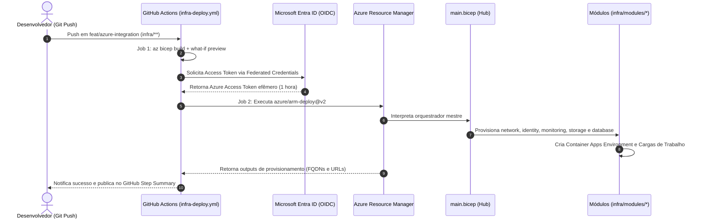
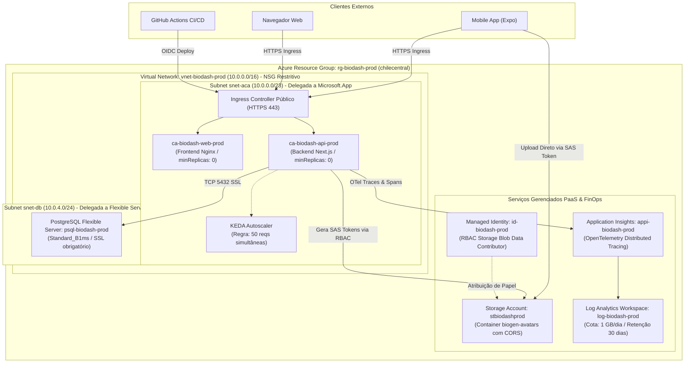

# Catálogo e Índice Geral de Diagramas de Arquitetura

---

## 📌 1. Visão Geral do Catálogo

Este documento centraliza e cataloga todos os diagramas arquiteturais do projeto **BioGen / BioDash**, provisionados em formato vetorial editável **Draw.io (`.drawio`)** dentro do diretório [`diagrams/`](./diagrams/).

Os arquivos foram gerados segundo as diretrizes de engenharia de software e a [drawio-skill](../../../../Users/Gueff/.gemini/config/skills/drawio-skill/SKILL.md), apresentando topologia validada estruturalmente com **zero erros e zero colisões de traçado**.

Para visualização imediata no GitHub e em leitores de Markdown, cada seção apresenta a especificação técnica, o link para o arquivo editável e a respectiva projeção renderizável em **Mermaid**.

---

## 🗺️ 2. Matriz Geral de Diagramas

| # | Título do Diagrama | Arquivo Draw.io Editável | Escopo / Domínio | Checklist |
| :-: | :--- | :--- | :--- | :--- |
| **1** | **Migração AWS para Azure** | [**`migration_aws_to_azure.drawio`**](./diagrams/migration_aws_to_azure.drawio) | Transição arquitetural completa, enquadramento dos 6 R's e modernização serverless. | Seções 3.1, 3.2, 8.2 |
| **2** | **Codificação IaC (Bicep)** | [**`iac_architecture.drawio`**](./diagrams/iac_architecture.drawio) | Orquestração Hub & Spoke, módulos declarativos Bicep e CI/CD OIDC Passwordless. | Seções 3.4, 3.9, 3.10 |
| **3** | **Infraestrutura Azure** | [**`azure_infrastructure.drawio`**](./diagrams/azure_infrastructure.drawio) | Topologia de nuvem, rede VNet, Container Apps, PostgreSQL e governança FinOps. | Seções 3.4, 3.5, 3.6 |
| **4** | **Microsserviços (FE, Chatbot, BE)** | [**`microservices_architecture.drawio`**](./diagrams/microservices_architecture.drawio) | Comunicação entre Frontend (Expo), Backend Core (Next.js) e AI-Service (FastAPI). | Seções 3.2, 3.5, 3.8 |

---

## 📐 3. Detalhamento dos Diagramas

### 3.1. Diagrama de Migração AWS para Azure
* **Arquivo Editável:** [`diagrams/migration_aws_to_azure.drawio`](./diagrams/migration_aws_to_azure.drawio)
* **Finalidade:** Contrastar visualmente a infraestrutura legada na Amazon Web Services (hospedada em máquinas virtuais EC2 e acoplada a SDKs proprietários) com a infraestrutura modernizada na Microsoft Azure (orientada a microsserviços serverless com escala a zero, Ports & Adapters e governança FinOps de custo zero).

```mermaid
graph LR
    subgraph AWS_Legada["1. Arquitetura Original (AWS EC2)"]
        AWS_Clients["Mobile & Web Clients"] -->|HTTP 80| AWS_EC2_Front["EC2 Frontend (Nginx)"]
        AWS_Clients -->|HTTP 3003| AWS_EC2_Back["EC2 Backend (Express)"]
        AWS_EC2_Back -->|SQL 5432| AWS_RDS["RDS PostgreSQL"]
        AWS_EC2_Back -->|TCP 27017| AWS_Mongo["EC2 MongoDB Host"]
        AWS_EC2_Back -->|AWS SDK| AWS_S3["Amazon S3 (biogen-s3)"]
        AWS_DevOps["DevOps"] -->|SSH Key| AWS_EC2_Back
    end

    subgraph Transicao_6Rs["2. Estratégia de Transição (6 R's)"]
        T1["Refactor: Ports & Adapters Storage"]
        T2["Replatform: VMs ➔ Azure Container Apps"]
        T3["Replatform: RDS ➔ PostgreSQL Flexible B1ms"]
        T4["Refactor: SSH ➔ OIDC Passwordless"]
        T5["Refactor: CloudWatch ➔ OpenTelemetry"]
        T6["FinOps: Docker Hub (Proibido ACR/AKS)"]
    end

    subgraph Azure_Alvo["3. Arquitetura Alvo (Microsoft Azure)"]
        Az_Clients["Mobile & Web Clients"] -->|HTTPS Ingress| ACA_Web["ACA Frontend (Expo Web)"]
        Az_Clients -->|HTTPS REST| ACA_API["ACA Backend (Next.js)"]
        Az_Clients -->|SAS Token Direct PUT| Az_Blob["Azure Blob (avatars)"]
        ACA_API -->|VNet SSL| Az_PG["PostgreSQL Flexible Server"]
        ACA_API -->|OTel Traces & Logs| Az_AppInsights["Application Insights"]
        GH_Actions["GitHub Actions OIDC"] -->|Zero Secrets Deploy| ACA_API
    end

    AWS_Legada ==> Transicao_6Rs ==> Azure_Alvo
```



---

### 3.2. Diagrama de Codificação IaC (Azure Bicep)
* **Arquivo Editável:** [`diagrams/iac_architecture.drawio`](./diagrams/iac_architecture.drawio)
* **Finalidade:** Ilustrar o ciclo de vida completo da Infraestrutura como Código, desde o push no GitHub Actions, passando pela validação sintática (*linter*), prévia de impacto (*what-if*), autenticação federada via OpenID Connect (OIDC) com o Microsoft Entra ID, até a compilação e provisionamento modular do `main.bicep` e seus submódulos em `infra/modules/`.



---

### 3.3. Diagrama de Infraestrutura Azure (Topologia Física e Lógica)
* **Arquivo Editável:** [`diagrams/azure_infrastructure.drawio`](./diagrams/azure_infrastructure.drawio)
* **Finalidade:** Representar a topologia de nuvem detalhada no Resource Group `rg-biodash-prod` (região `chilecentral`), evidenciando a Virtual Network (`10.0.0.0/16`), sub-redes delegadas, regras restritivas de Network Security Group (NSG), contêineres com escala a zero via KEDA e recursos PaaS com Managed Identity.



---

### 3.4. Diagrama de Microsserviços (Frontend, Chatbot e Backend Core)
* **Arquivo Editável:** [`diagrams/microservices_architecture.drawio`](./diagrams/microservices_architecture.drawio)
* **Finalidade:** Mapear a arquitetura lógica de microsserviços do ecossistema BioGen / BioDash, documentando as responsabilidades e protocolos de integração entre a aplicação cliente (`BioDash_mobile`), a API central de negócios (`BioDashBD`) e o microsserviço especializado de inteligência artificial (`BioDash_ai-service`).

```mermaid
graph TD
    subgraph Frontend["1. FRONTEND: BioDash_mobile (Expo / React Native)"]
        UI["Telas: Monitoramento, Incidentes, Chatbot e Perfil"]
        StorageClient["Universal Storage Client (lib/storage.ts)<br>Cabeçalho: x-ms-blob-type: BlockBlob"]
        HTTPClient["HTTP REST Client (Axios)<br>Configurado via EXPO_PUBLIC_API_URL"]
        UI --> StorageClient
        UI --> HTTPClient
    end

    subgraph Backend["2. BACKEND API CORE: BioDashBD (Next.js Node.js)"]
        APIRoutes["Rotas REST: /api/biodigesters, /api/metrics, /api/alerts"]
        StoragePorts["Ports & Adapters: IFileStoragePort<br>AzureBlobStorageAdapter (SAS Tokens)"]
        DBPool["Pool Relacional (node-postgres com SSL)"]
        APIRoutes --> StoragePorts
        APIRoutes --> DBPool
    end

    subgraph AIService["3. AI SERVICE: BioDash_ai-service (FastAPI Python)"]
        FastAPIRoutes["Endpoints: POST /api/chat e POST /api/transcribe"]
        Whisper["Faster-Whisper (Modelo: small / CPU int8)"]
        LangChain["RAG / LangChain (Contexto de Biodigestores)"]
        FastAPIRoutes --> Whisper
        FastAPIRoutes --> LangChain
    end

    subgraph Persistencia["4. Persistência & Observabilidade"]
        PG["PostgreSQL Flexible Server (B1ms)"]
        Blob["Azure Blob Storage (biogen-avatars)"]
        Supa["Supabase (Auth & Fallback)"]
        OTel["Application Insights (OTel Tracing)"]
    end

    HTTPClient -->|HTTPS REST / JWT| APIRoutes
    APIRoutes -->|Proxy / Chamada de Chat e Áudio| FastAPIRoutes
    StorageClient -->|Upload Binário Direto (PUT)| Blob
    StoragePorts -->|Gera SAS Tokens Efêmeros| Blob
    DBPool -->|Consultas SQL| PG
    LangChain -->|Contexto de Usuários| Supa
    APIRoutes -->|Distributed Tracing| OTel
```

---