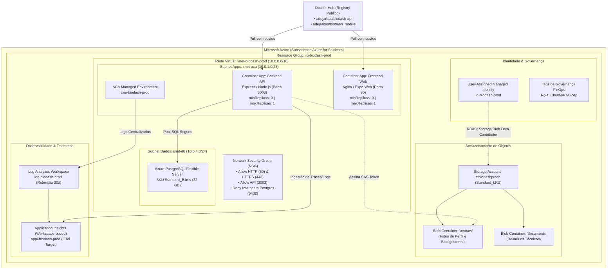

# Relatório Técnico de Infraestrutura como Código (IaC) com Azure Bicep (Marco 3)

**Projeto:** BioGen / BioDash — Sistema de Gestão e Monitoramento de Biodigestores  
**Etapa:** Marco 3 — Provisionamento da Infraestrutura (IaC) e Rede no Azure  
**Responsável:** Cloud Azure & IaC Bicep  
**Assinatura Alvo:** Azure for Students (FinOps — Custo Zero Absoluto)  
**Linguagem de IaC:** Microsoft Bicep (Orquestração Modular)  
**Status:** Concluído e Validado

---

## 1. Resumo Executivo e Atribuições

O **Marco 3** do projeto de migração de infraestrutura da **AWS para o Microsoft Azure** compreende a definição formal, estruturada e automatizada de toda a topologia de nuvem necessária para a sustentação do sistema **BioDash**.

Conforme estabelecido no planejamento de papéis do projeto, as atribuições de **Cloud Azure & IaC Bicep** englobam:
1. **Provisionamento 100% Declarativo via Código (IaC):** Eliminação integral de qualquer criação manual no portal da Azure, garantindo rastreabilidade, reprodutibilidade e conformidade com auditorias de software.
2. **Arquitetura Modular em Bicep (`/infra`):** Separação de conceitos em módulos específicos (`network`, `identity`, `monitoring`, `storage`, `container-apps-env`, `container-apps`, `database`).
3. **Topologia de Rede e Segurança Estruturada:** Criação de Virtual Network (VNet), subnets segregadas por função e Network Security Group (NSG) com regras de firewall restritivas.
4. **Armazenamento de Imagens e Documentos:** Provisionamento de Storage Account com suporte a CORS para upload via SAS Tokens pelo aplicativo mobile/web, contendo o container **`avatars`** (para fotos de biodigestores e perfis) e integração RBAC com **User-Assigned Managed Identity**.
5. **Ambiente de Execução Serverless de Baixo Custo:** Configuração do **Azure Container Apps (ACA)** puxando imagens de contêineres do **Docker Hub**, com autoscaling KEDA parametrizado com **`minReplicas: 0`** (escala a zero para retenção total de custos).
6. **Governança FinOps:** Aplicação de diretrizes rigorosas que garantem a operação contínua dentro dos limites gratuitos da assinatura *Azure for Students*.

---

## 2. Diagrama da Topologia de Nuvem Provisionada

O diagrama a seguir ilustra a infraestrutura provisionada pelo orquestrador `main.bicep`:



---

## 3. Detalhamento dos Módulos Bicep (`/infra/modules`)

A infraestrutura foi estruturada de forma modular, permitindo testes isolados, manutenção independente e reutilização entre múltiplos ambientes (`dev`, `staging`, `prod`):

### 3.1. Módulo de Rede e Segurança (`modules/network.bicep`)
- **Virtual Network (`vnet-biodash-prod`):** Espaço de endereçamento `10.0.0.0/16`.
- **Subnet para Container Apps (`snet-aca`):** Prefixo `10.0.1.0/23`, delegada a `Microsoft.App/environments`.
- **Subnet para Banco de Dados (`snet-db`):** Prefixo `10.0.4.0/24`, delegada a `Microsoft.DBforPostgreSQL/flexibleServers`.
- **Network Security Group (`nsg-biodash-prod`):**
  - `Allow-HTTP-Inbound` (Prioridade 100): Tráfego web externo na porta 80.
  - `Allow-HTTPS-Inbound` (Prioridade 110): Tráfego seguro TLS/SSL na porta 443.
  - `Allow-API-Inbound` (Prioridade 120): Chamadas diretas à API Express na porta 3003.
  - `Deny-Database-Internet` (Prioridade 200): **Bloqueio explícito e mandatório de qualquer conexão externa direta ao PostgreSQL na porta 5432.**
  - `Allow-VNet-Internal` (Prioridade 300): Comunicação irrestrita e segura entre os recursos internos da VNet.

### 3.2. Módulo de Identidade Gerenciada (`modules/identity.bicep`)
- Provisiona uma **User-Assigned Managed Identity (`id-biodash-prod`)**.
- Evita o armazenamento de credenciais, chaves de API ou connection strings com senhas nos contêineres de aplicação.
- Integra-se com o SDK da Azure via `DefaultAzureCredential`.

### 3.3. Módulo de Observabilidade (`modules/monitoring.bicep`)
- **Log Analytics Workspace (`log-biodash-prod`):**
  - SKU `PerGB2018` com retenção fixada em **30 dias** (compatível com a camada gratuita de 5 GB/mês).
  - Teto de ingestão diário (**Daily Quota = 1 GB**) para proteger contra estouro acidental de cota.
- **Application Insights (`appi-biodash-prod`):**
  - Configurado em modo integrado ao Workspace (*Workspace-based*).
  - Disponibiliza a `appInsightsConnectionString` utilizada pela instrumentação do **OpenTelemetry (OTel)** no backend Node.js.

### 3.4. Módulo de Armazenamento de Arquivos (`modules/storage.bicep`)
- **Storage Account (`stbiodashprod*`):**
  - SKU: `Standard_LRS` (redundância local de menor custo).
  - Camada de acesso: `Hot`.
  - Requisito de segurança: `supportsHttpsTrafficOnly: true`, `minimumTlsVersion: 'TLS1_2'`, `allowBlobPublicAccess: false` (sem blobs anônimos).
- **Blob Containers:**
  - **`avatars`:** Container específico requisitado para salvar fotos de perfil e biodigestores através do `AzureBlobStorageAdapter`.
  - **`documents`:** Destinado a relatórios gerados.
- **CORS (Cross-Origin Resource Sharing):** Habilitado para os verbos `GET, POST, PUT, DELETE, OPTIONS`, viabilizando o upload direto de imagens a partir do cliente mobile/web utilizando **SAS Tokens** com expiração controlada.
- **Concessão de Papel RBAC:** Atribuição do papel **Storage Blob Data Contributor** (`ba92f5b4-2d11-453d-a403-e96b0029c9fe`) à Managed Identity do Container App.

### 3.5. Módulo de Container Apps Environment (`modules/container-apps-env.bicep`)
- Cria o **Azure Container Apps Managed Environment (`cae-biodash-prod`)**.
- Encaminha automaticamente logs de stdout/stderr de todos os microserviços para o Log Analytics.
- Desativa redundância de zona (`zoneRedundant: false`) para assegurar conformidade FinOps.

### 3.6. Módulo de Execução de Contêineres (`modules/container-apps.bicep`)
- **Backend API Container App (`ca-biodash-api-prod`):**
  - Imagem: Docker Hub (`docker.io/adejarbas/biodash-api:latest`).
  - Recursos: `cpu: 0.25`, `memory: 0.5Gi`.
  - **Escala a Zero (FinOps):** `minReplicas = 0`, `maxReplicas = 1`.
  - Regra de escalonamento HTTP (KEDA): Escala para 1 réplica após 50 requisições simultâneas.
  - Probes HTTP:
    - *Liveness Probe*: `/api/alerts` a cada 30 segundos.
    - *Readiness Probe*: `/api/alerts` a cada 20 segundos.
  - Injeção de variáveis de ambiente: `AZURE_STORAGE_ACCOUNT_NAME`, `AZURE_STORAGE_CONTAINER_NAME=avatars`, `APPLICATIONINSIGHTS_CONNECTION_STRING`, `PORT=3003`, `NODE_ENV=production`.
- **Frontend Web Container App (`ca-biodash-web-prod`):**
  - Imagem: Docker Hub (`docker.io/adejarbas/biodash_mobile:latest`).
  - Recursos: `cpu: 0.25`, `memory: 0.5Gi`.
  - **Escala a Zero:** `minReplicas = 0`, `maxReplicas = 1`.
  - Ingress público na porta 80.

### 3.7. Módulo de Banco Relacional (`modules/database.bicep`)
- **Azure Database for PostgreSQL Flexible Server:**
  - SKU: `Standard_B1ms` (1 vCPU, 2 GiB de memória, tier Burstable).
  - Disco: 32 GB.
  - Elegível às **750 horas mensais gratuitas** da assinatura *Azure for Students*.

---

## 4. Matriz de FinOps e Custo Zero

A tabela a seguir comprova a viabilidade financeira e a garantia de custo zero sob a assinatura de estudante da Microsoft:

| Recurso na Azure | Parâmetro no Bicep | Limite Gratuito Azure for Students | Custo Estimado |
| :--- | :--- | :--- | :---: |
| **Azure Container Apps (Compute)** | `minReplicas: 0`<br>`maxReplicas: 1`<br>`cpu: 0.25`<br>`memory: 0.5Gi` | 180.000 vCPU-segundos/mês<br>360.000 GiB-segundos/mês<br>2.000.000 requisições/mês | **$ 0,00** |
| **Registro de Imagens** | Docker Hub (Público) | ❌ **ACR proibido no projeto**<br>Docker Hub sem custos para imagens públicas | **$ 0,00** |
| **Azure Blob Storage** | SKU `Standard_LRS`<br>Tier `Hot` | Até 5 GB de armazenamento LRS gratuito na conta estudantil | **$ 0,00** |
| **Log Analytics & App Insights** | Retenção: 30 dias<br>Daily Cap: 1 GB | 5 GB/mês de ingestão gratuita no Azure Monitor | **$ 0,00** |
| **PostgreSQL Flexible Server** | `Standard_B1ms`<br>32 GB Storage | 750 horas/mês gratuitas no primeiro ano da assinatura | **$ 0,00** |
| **Rede Virtual & NSG** | VNet + Subnets + NSG | VNets e NSGs são recursos sem custo de provisionamento | **$ 0,00** |
| **Identidade (Entra ID)** | Managed Identity | Identidades gerenciadas não possuem cobrança | **$ 0,00** |
| **TOTAL GERAL FINOPS** | — | — | **$ 0,00 / mês** |

---

## 5. Orquestradores: `main.bicep` vs. `subscription.bicep`

Para oferecer flexibilidade máxima à equipe de engenharia e ao pipeline de CI/CD, dois orquestradores foram desenvolvidos:

1. **`infra/main.bicep` (`targetScope = 'resourceGroup'`):**
   - Utilizado pelo GitHub Actions através da Action oficial `azure/arm-deploy@v2`.
   - Aplica os módulos diretamente no Resource Group informado nas variáveis do workflow.
2. **`infra/subscription.bicep` (`targetScope = 'subscription'`):**
   - Cria o Resource Group `rg-biodash-prod` em nível de assinatura e delega a criação dos recursos ao `main.bicep`.
   - Permite o provisionamento "do zero absoluto" com um único comando na CLI:
     ```bash
     az deployment sub create --location brazilsouth --template-file ./infra/subscription.bicep
     ```

---

## 6. Validação e Qualidade de Código

Todos os arquivos Bicep seguem as melhores práticas recomendadas pela Microsoft:
- Tipagem estrita com decorators `@description`, `@allowed` e `@secure()`.
- Nomes de recursos gerados deterministicamente com funções de hash `uniqueString()`.
- Separação clara de parâmetros e variáveis (`var`).
- Outputs padronizados disponibilizados para consumo imediato pelo pipeline de CI/CD.
