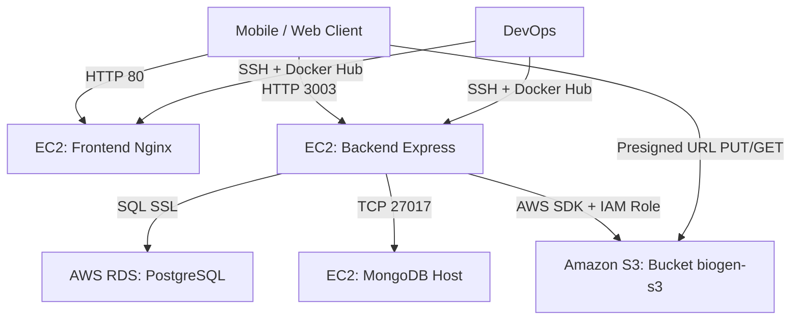
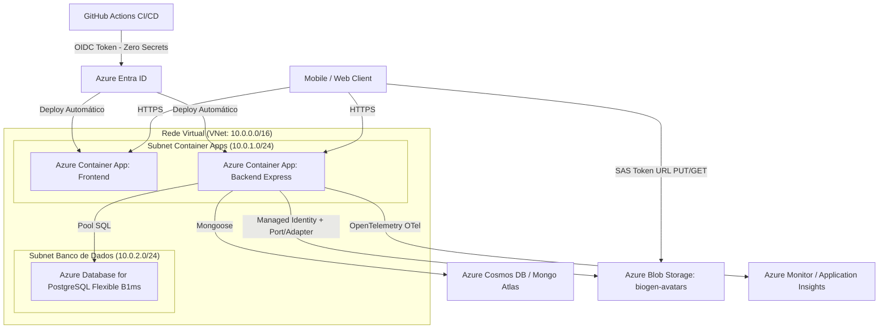

# Relatório de Diagnóstico Arquitetural e Auditoria de Lock-in (Marco 1)
**Projeto:** BioGen / BioDash — Sistema de Gestão e Monitoramento de Biodigestores  
**Finalidade:** Diagnóstico Arquitetural Inicial e Estratégia de Desacoplamento para Migração AWS ➔ Microsoft Azure  
**Público-Alvo:** Equipe de Engenharia, Governança Cloud, DevOps e Avaliação Acadêmica  
**Data:** 03 de Outubro de 2026  
**Status:** Aprovado para Execução (Marco 1 Concluído)

---

## 1. Resumo Executivo

O projeto **BioDash** consiste em uma plataforma de monitoramento em tempo real de biodigestores voltada a indústrias agropecuárias e alimentícias, abrangendo métricas de produção de biogás, geração elétrica, créditos fiscais e gestão de incidentes operacionais.

A infraestrutura original operava na **Amazon Web Services (AWS)** utilizando um modelo híbrido de máquinas virtuais (EC2), banco relacional gerenciado (RDS PostgreSQL) e armazenamento de objetos (S3). Este relatório formaliza o **Marco 1** do projeto de modernização arquitetural, cujo objetivo central é:
1. Auditar e inventariar integralmente todos os serviços utilizados na AWS.
2. Identificar os pontos de acoplamento direto a SDKs proprietários (*vendor lock-in*).
3. Classificar os componentes por grau de dependência tecnológica.
4. Estabelecer a estratégia formal de migração (Refactor vs. Replatform) com aderência irrestrita aos princípios de **FinOps** (operando com custo zero sob a assinatura *Azure for Students*).

---

## 2. Inventário Completo de Recursos AWS

A auditoria identificou os seguintes serviços e artefatos de infraestrutura no ecossistema da aplicação:

| Categoria | Recurso AWS Original | Artefato / Arquivo de Referência | Descrição Técnica no Projeto |
| :--- | :--- | :--- | :--- |
| **Compute** | **Amazon EC2 (Frontend)** | `docker-compose.frontend.yml` / `Dockerfile` | Contêiner Docker executando Expo Web servido via Nginx na porta `80`. |
| **Compute** | **Amazon EC2 (Backend API)** | `backend/Dockerfile` / `backend/src/server.js` | API REST Node.js/Express na porta `3003` associada ao domínio `biodash-api.duckdns.org`. |
| **Compute** | **Amazon EC2 (Dashboard Next.js)** | `BioDashBD/docker-compose.yml` | Aplicação Next.js (App Router) rodando nas portas `80` e `3003`. |
| **Compute** | **Amazon EC2 (MongoDB Host)** | `backend/src/server.js` (Mongoose connection) | Instância hospedeira de banco NoSQL MongoDB para armazenamento de marcadores de mapa e geolocalização. |
| **Compute** | **AWS Lambda** | Documentação e Requisitos (RNF013) | Pipeline serverless assíncrona descrita para ingestão e notificação de eventos anômalos de telemetria de sensores. |
| **Data** | **Amazon RDS (PostgreSQL)** | `backend/src/database/pg.js` | Instância gerenciada `database-1...rds.amazonaws.com:5432`, com schemas relacionais de usuários, perfis, histórico de métricas e manutenções. |
| **Data** | **Amazon S3 (Bucket)** | `backend/src/routes/s3.js` | Bucket `biogen-s3` (região `us-east-1`) para armazenamento de fotos de perfil e documentos de empresas. |
| **Data** | **MongoDB (NoSQL)** | `backend/src/server.js` / Schema `Marker` | Coleções de documentos geoespaciais e marcadores cadastrados pelos usuários. |
| **Mensageria** | **REST APIs Síncronas** | `backend/src/routes/alerts.js` | Comunicação direta via HTTP/JSON. Filas proprietárias (SQS/SNS) não foram acopladas no código de produção. |
| **IAM** | **IAM Instance Profile / Role** | `backend/src/routes/s3.js` | Autenticação implícita do SDK AWS via metadados da EC2 para assinar URLs S3 sem chaves estáticas. |
| **IAM** | **IAM Access Keys (Dev)** | `.env` (`EXPO_PUBLIC_AWS_*`) | Credenciais estáticas temporárias de desenvolvedor para testes locais. |
| **Rede** | **VPC & Security Groups** | Regras de firewall AWS | Liberação das portas `80` (HTTP), `3003` (API), `5432` (PostgreSQL), `27017` (MongoDB) e `22` (SSH). |
| **CI/CD** | **GitHub Actions + SSH** | `.github/workflows/mobile-ci-cd.yml` | Pipeline de compilação Docker, publicação em Docker Hub e deploy remoto via conexão SSH direta na VM. |
| **Observabilidade**| **CloudWatch / Console** | Logs de container Docker / Winston | Emissão de logs padrão em stdout e menção a métricas de infraestrutura no CloudWatch. |

---

## 3. Classificação de Acoplamento

Cada elemento arquitetural foi classificado em três níveis de acoplamento técnico para orientar a tomada de decisão:

```
┌────────────────────────────────────────────────────────────────────────┐
│                      NÍVEIS DE ACOPLAMENTO TÉCNICO                     │
├─────────────────────┬──────────────────────────┬───────────────────────┤
│    🟢 AGNÓSTICO     │   🟡 LEVEMENTE ACOPLADO  │  🔴 ALTAMENTE ACOPLADO│
├─────────────────────┼──────────────────────────┼───────────────────────┤
│ • Contêineres Docker│ • Upload/Download S3 SDK │ • (Nenhum componente  │
│ • Schema PostgreSQL │ • Parsing URLs no Front  │    crítico do projeto │
│ • Mongoose / MongoDB│ • IAM Instance Role      │    utiliza serviços   │
│ • Autenticação JWT  │ • Deploy SSH com IP fixo │    bloqueadores como  │
│ • Rotas REST Express│ • CloudWatch Logs        │    DynamoDB nativo ou │
│ • App Expo/React    │                          │    AWS Cognito)       │
└─────────────────────┴──────────────────────────┴───────────────────────┘
```

### 3.1. Componentes Agnósticos (🟢 Baixo Risco)
* **Contêineres de Aplicação:** Os arquivos `Dockerfile` e os bundles estáticos do Nginx não têm vínculo com fornecedor de computação.
* **Camada de Banco Relacional:** O pool de conexão em `backend/src/database/pg.js` utiliza a biblioteca padrão `pg` (node-postgres) com SSL padrão. O schema DDL (`schema.sql`) é SQL puro compatível com qualquer distribuição PostgreSQL 14+.
* **Persistência de Marcadores:** O Mongoose utiliza conexão via URI padrão de MongoDB (`mongodb+srv://...` ou `mongodb://...`), funcionando identicamente em qualquer nuvem.
* **Autenticação:** Baseada em tokens JWT (`jsonwebtoken`) assinados e senhas salgadas via `bcryptjs`. Não há amarração ao AWS Cognito ou serviços proprietários de identidade.

### 3.2. Componentes Levemente Acoplados (🟡 Médio Risco - Pontos de Lock-in)
* **SDK do Amazon S3 (`@aws-sdk/client-s3` e `@aws-sdk/s3-request-presigner`):**
  * Presente no arquivo de rotas `backend/src/routes/s3.js`.
  * Utiliza comandos proprietários `PutObjectCommand` e `GetObjectCommand`, além da função `getSignedUrl`.
* **Frontend Mobile / Web:**
  * O arquivo `src/screens/CompanyProfileScreen.tsx` (linhas 125-127) contém lógica acoplada para detectar a procedência da imagem através de busca textual pela substring `'amazonaws.com/'`.
* **Identidade de Infraestrutura:**
  * O backend assume que credenciais de nuvem podem ser recuperadas transparentemente do serviço de metadados da instância (IMDSv2 da AWS EC2).
* **Pipeline de Deploy:**
  * Os fluxos de CI/CD em `.github/workflows/` dependem de segredos estáticos (`EC2_HOST`, `EC2_SSH_KEY`) para realizar SSH imperativo em servidores virtuais dedicados.

### 3.3. Componentes Altamente Acoplados (🔴 Lock-in Severo)
* **Diagnóstico:** **Inexistente na base de código atual.**
* **Análise:** O projeto não utilizou Amazon DynamoDB Single-Table Design, AWS AppSync (GraphQL proprietário), Step Functions ou bibliotecas proprietárias que exigiriam reescrita profunda do domínio da aplicação. Isso viabiliza uma migração limpa e de baixo custo.

---

## 4. Pontos Críticos de Lock-in no Código-Fonte

A auditoria estática identificou os pontos exatos do código que violam a separação de responsabilidades e introduzem dependências da AWS:

### 4.1. Chamada Direta a SDK Proprietário no Backend
* **Arquivo:** `backend/src/routes/s3.js` (Linhas 2-3, 10-13, 36-43, 71-77)
* **Violação:** A camada de roteamento HTTP instancia diretamente o cliente AWS e cria comandos específicos da AWS:
```javascript
// PONTO DE LOCK-IN:
const { S3Client, PutObjectCommand, GetObjectCommand } = require('@aws-sdk/client-s3');
const { getSignedUrl } = require('@aws-sdk/s3-request-presigner');

const s3 = new S3Client({ region: process.env.AWS_REGION || 'us-east-1' });
```
* **Impacto:** Impede o desacoplamento e força a instalação de pacotes pesados do ecossistema AWS no `node_modules`.

### 4.2. Acoplamento de URL no Frontend
* **Arquivo:** `src/screens/CompanyProfileScreen.tsx` (Linhas 125-127)
* **Violação:**
```typescript
// PONTO DE LOCK-IN:
const key = profile.avatar_url.includes('amazonaws.com/')
    ? profile.avatar_url.split('amazonaws.com/')[1]
    : profile.avatar_url;
```
* **Impacto:** Quebra a renderização das fotos assim que a URL for substituída pelo padrão `blob.core.windows.net`.

### 4.3. Variáveis de Ambiente Proprietárias
* **Arquivos:** `.env`, `.env-exemple`, `backend/.env`
* **Violação:** Variáveis `EXPO_PUBLIC_AWS_REGION`, `EXPO_PUBLIC_AWS_BUCKET_NAME`, `EXPO_PUBLIC_AWS_ACCESS_KEY_ID`, `EXPO_PUBLIC_AWS_SECRET_ACCESS_KEY`.
* **Impacto:** Poluição de configurações específicas de fornecedor na camada de build do cliente mobile.

---

## 5. Estratégia de Migração por Componente (Framework 6 R's)

Adotou-se o modelo internacional dos 6 R's da computação em nuvem para classificar o tratamento de cada elemento:

```
┌───────────────────────────┬──────────────┬────────────────────────────────────────────────────────┐
│ Componente                │ Estratégia   │ Justificativa e Ação Técnica no Azure                  │
├───────────────────────────┼──────────────┼────────────────────────────────────────────────────────┤
│ Storage de Arquivos (S3)  │ REFACTOR     │ Implementar Ports & Adapters (IFileStorage) com        │
│                           │              │ adaptador Azure Blob Storage gerador de SAS Tokens.    │
├───────────────────────────┼──────────────┼────────────────────────────────────────────────────────┤
│ Banco Relacional (RDS)    │ REPLATFORM   │ Provisionar Azure Database for PostgreSQL (Flexible    │
│                           │              │ Server, B1ms). Schema e queries SQL inalterados.       │
├───────────────────────────┼──────────────┼────────────────────────────────────────────────────────┤
│ Computação (EC2 VMs)      │ REPLATFORM   │ Substituir VMs por Azure Container Apps (ACA) com     │
│                           │              │ escalonamento a zero (KEDA) para garantia de custo $0. │
├───────────────────────────┼──────────────┼────────────────────────────────────────────────────────┤
│ Banco NoSQL (Marcadores)  │ REPLATFORM   │ Utilizar Azure Cosmos DB for MongoDB (vCore / Free)    │
│                           │              │ ou manter cluster Atlas M0 sem custo no Azure.         │
├───────────────────────────┼──────────────┼────────────────────────────────────────────────────────┤
│ Identidade / IAM          │ REFACTOR     │ Substituir IAM Instance Role por Azure Managed         │
│                           │              │ Identity (System-Assigned) com RBAC de Blob.           │
├───────────────────────────┼──────────────┼────────────────────────────────────────────────────────┤
│ Pipelines DevOps          │ REFACTOR     │ Substituir deploy SSH imperativo por GitHub Actions    │
│                           │              │ com autenticação OIDC e Azure Container Apps action.   │
├───────────────────────────┼──────────────┼────────────────────────────────────────────────────────┤
│ Observabilidade           │ REFACTOR     │ Implementar OpenTelemetry SDK desacoplado exportando   │
│                           │              │ traces e logs estruturados ao Application Insights.    │
└───────────────────────────┴──────────────┴────────────────────────────────────────────────────────┘
```

---

## 6. Diagramas Arquiteturais

### 6.1. Arquitetura Original (AWS - Monolítica em VM com Acoplamento)


### 6.2. Arquitetura Alvo (Microsoft Azure - Serverless, Desacoplada e Custo Zero)


---

## 7. Diretrizes FinOps e Governança (Azure for Students)

Para assegurar **Custo Zero** e preservar os créditos de estudante:
1. **Bloqueio de Serviços On-Demand Pagos:**
   * ❌ **Proibido Azure Container Registry (ACR):** Utilização estrita do **GitHub Container Registry (GHCR)** ou **Docker Hub** (armazenamento e tráfego gratuitos).
   * ❌ **Proibido Azure Kubernetes Service (AKS):** Custo de cluster e nós inviável para cota de estudantes.
   * ❌ **Proibido VMs dedicadas ligadas 24/7:** Máquinas virtuais sem desligamento automático consomem a franquia rapidamente.
2. **Dimensionamento Rigoroso de Serviços Gratuitos:**
   * **Azure Container Apps:** Configurado com réplicas mínimas `minReplicas = 0` (escala a zero quando ocioso) e réplicas máximas `maxReplicas = 1`.
   * **PostgreSQL Flexible Server:** SKU `Standard_B1ms` (coberto pela gratuidade de até 750 horas/mês na camada inicial).
   * **Storage Account:** SKU Standard LRS com container de acesso privado.

---

## 8. Conclusão do Marco 1 e Próximos Passos

O diagnóstico inicial atesta que o projeto possui excelente viabilidade de migração devido à ausência de lock-in em banco de dados ou mensageria proprietária. O principal gargalo reside na camada de arquivos e credenciais de infraestrutura.

**Plano Imediato para o Marco 2:**
1. Criação do contrato universal `IFileStorage` na pasta `src/ports/`.
2. Criação do `AzureBlobStorageAdapter` utilizando `@azure/storage-blob` com autenticação via `DefaultAzureCredential` / `Managed Identity`.
3. Manutenção do `AwsS3StorageAdapter` para referência de desacoplamento.
4. Refatoração do roteador HTTP para delegar exclusivamente à interface abstrata.

